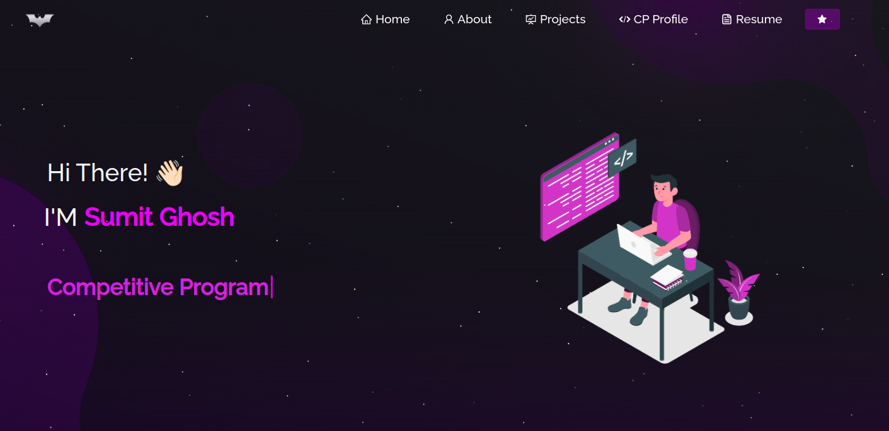

<h1 align="center">🌟 Portfolio Website 🌟</h1>
<p align="center">
  
</p>


<p align="center">
  <a href="https://github.com/Sumitwarrior7/Portfolio-2.0/issues">🛠 Report Bug</a> &nbsp; | &nbsp;
  <a href="https://github.com/Sumitwarrior7/Portfolio-2.0/issues">✨ Request Feature</a>
</p>

---

## 🚀 About the Project

This is my personal portfolio website, showcasing:  
- About Me
- My resume  
- A summary of my technical skills 
- Description of projects
- My competetive programming profiles

---

## 🛠 Built With

This project was built using the following technologies:

- **React.js**
- **Node.js**
- **CSS3**
- **Vercel**

---

## ✨ Features

- 📖 **Multi-Page Layout**
- 🌟 **Styled with React-Bootstrap and CSS for easy customization**
- 📱 **Fully Responsive Design**

---

## 🚀 Getting Started

To get started with this project, clone the repository. Ensure you have `node.js` and `git` installed globally on your machine.

### Installation and Setup Instructions

1. **Fork this repository**  

2. **Clone the forked repository**  
   ```bash
   git clone https://github.com/<username>/Portfolio-2.0.git
   ```

3. **Install dependencies**
   ```bash
   npm install
   ```

4. **Run the application**
   ```bash
   npm start
   ```
   This will start the app in development mode. Open [http://localhost:3000](http://localhost:3000) in your browser to view the website.  
   The page will reload if you make edits.

---

## 📂 Usage Instructions

1. Open the project folder.
2. Navigate to the `/src/components/` directory.
3. Edit the components to update your information, such as projects, skills, and personal details.

---

## 🤝 Contributing

Contributions, issues, and feature requests are welcome!  
Feel free to check the [issues page](https://github.com/Sumitwarrior7/Portfolio-2.0/issues) for more details.

---

## 💬 Contact

If you want to reach out, connect with me via [LinkedIn](https://www.linkedin.com/in/sumitghoshiitbhu21135133/) or email at `sumitheavydriver2017@gmail.com`.

<p align="center">Made with ❤️ by [Sumitwarrior7](https://github.com/Sumitwarrior7)</p>
